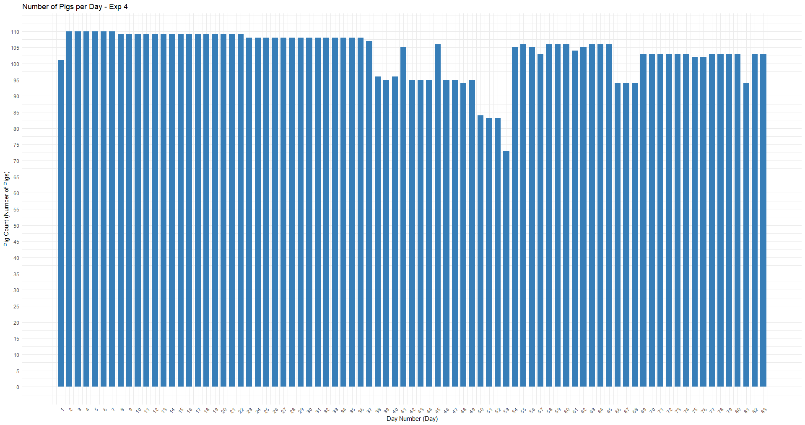
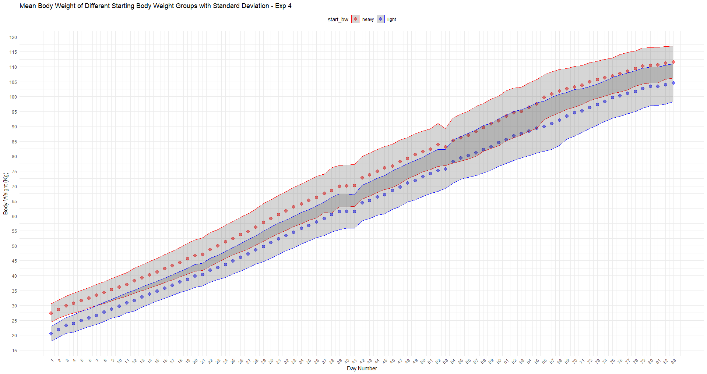
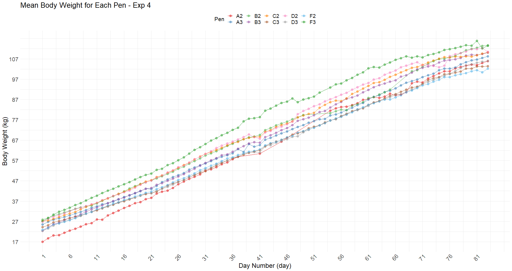
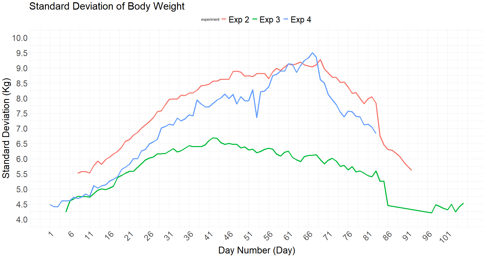
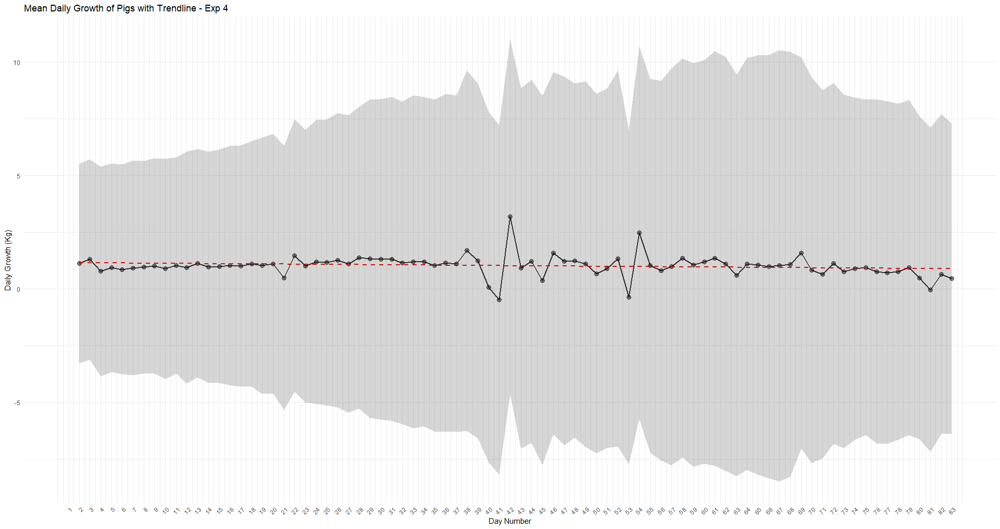
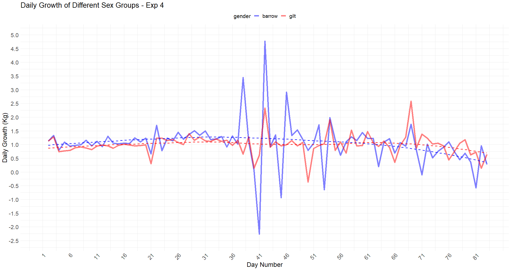

# 🐷 MSc-Thesis-PLF-Data-Analysis: Automated Bodyweight Modeling

**Thesis:** Exploring daily bodyweight of growing-finishing pigs using 3D depth camera

| **Author** | Jiwon(Jin) Ha |
| :--- | :--- |
| **Affiliation** | Wageningen University & Research (WUR) |
| **Status** | Available for roles in AgTech/IoT and Data Analysis (Netherlands) |

---

## 1. Project Overview & Problem Statement

This Master's thesis develops and evaluates an **automated, non-invasive method** for the continuous monitoring of individual pig bodyweight (BW) using **3D depth camera technology** (Precision Livestock Farming, PLF).

### Problem
Traditional BW monitoring methods are labour-intensive and stressful for the animals. This research addresses the need for accurate, long-term BW tracking to derive data-driven insights for improving animal welfare and farm management.

---

## 2. Technical Stack & Methodology

### Technologies Used
| Category | Tool / Method |
| :--- | :--- |
| **Data Analysis** | **R Studio** (Primary Language) |
| **Statistical Modeling** | **Linear Mixed Model (LMM)** (using `lme4` and `lmerTest` packages) |
| **Sensors/Vision** | iDOL 65 3D Depth Camera, YOLO-based identification |

### Methodology (Analysis Pipeline: Scripts 01-06)

The pipeline is structured across six dedicated R scripts:
* **Data Cleaning (01):** Stringent **3-step cleaning rules** applied, including filtering by **`nb.pictures >= 30`** (Quality QA) and removal of **Misplacement Outliers**.
* **Feature Engineering (03):** Creation of **5-day Moving Average (MA)** features for smoothed growth and calculation of **Lifetime Average Daily Gain (LADG)**.
* **Modeling (04 & 05):** LMM (Quadratic term for time) was fitted to establish **expected growth patterns**. Models included **Random Intercepts and Random Slopes** for individual pig (`pig_id`) and pen.

### Visual Proof: Methodological Decisions

This section provides visual evidence supporting the technical decisions made in the LMM structure and the data cleaning process.

### [Image 1] Data Quality Management (QA/QC)
The plot shows the daily count of pigs with acceptable weight measurements, demonstrating the real-world variability in camera coverage that necessitated our rigorous QA process.

### [Image 2] LMM Rationale: Fixed Effect (Starting BW)
A clear distinction in weight trajectories between 'Heavy' and 'Light' starting BW groups justifies the inclusion of **Starting BW as a critical fixed effect** in the Linear Mixed Model.

### [Image 3] LMM Rationale: Random Effect (Pen)
Significant variation in mean weight trajectories across different pens confirms the need to model **Pen as a Random Intercept**, accounting for unobserved environmental or group effects.

---

## 3. Key Findings & Contributions

| Finding | Detail |
| :--- | :--- |
| **Growth Trend** | Observed a general **linear growth trend** with mean daily gains between **0.985 kg and 1.05 kg** across experiments. |
| **Deviation Detection** | Residual analysis using a **2 kg threshold** effectively captured deviations, often indicating underperformance towards the **conclusion of experiments**. |
| **Sex Effect (Exp 4)** | **Barrows** showed higher ADG initially; **Gilts** displayed higher ADG after day 61, highlighting the need for sex-specific models. |
| **Monitoring Utility** | Validated 3D cameras for **long-term BW measurement** but emphasized the necessity of robust data cleaning and LMM diagnostics. |

### Core Results Visualized

### [Image 4] Cross-Experimental Data Variability Comparison
The comparison of Standard Deviation (SD) across Exp 2, 3, and 4 highlights relative noise levels, serving as a basis for interpreting LMM residual stability.

### [Image 5] Modeled Daily Growth Trend
The overall daily growth (ADG) trend for Exp 4, complete with the estimated range, visually defines the **expected growth trajectory** derived from the smoothed data.

### [Image 6] Key Discovery: Sex Effect on Daily Gain
Visual evidence confirming that Barrows have higher initial growth, while Gilts show higher growth after day 61, a critical finding informing sex-specific management.

---

## 4. Repository Structure & Reproducibility (Scripts 01-06)

The repository contains the complete, executable R analysis pipeline.

| File / Folder | Purpose |
| :--- | :--- |
| `R_Scripts/` | Contains all sequential R scripts (01 to 06) |
| `data/` | **(Local Only)** Placeholder for raw data files |
| `output/` | **(Local Only)** Placeholder for generated images and CSV outputs |

### 🚨 Data and Output Note

* **Data Security:** Raw data files and large intermediate CSV files are **not included** due to data privacy and security restrictions.
* **Reproducibility:** To fully reproduce the analysis, the user must first place the required raw data files (Exp X - Pig level camera weight data, Pig registration) into a local **`data/`** folder and then run the scripts sequentially starting from **`01_BW_Data_Cleaning_and_Preproc.R`**.

---

## 5. Contact & Availability

I am actively seeking roles in the AgTech/IoT and Data Analysis sectors.

* **LinkedIn:** [Jiwon Ha's Profile](https://www.linkedin.com/in/jiwon-ha)
* **Email:** `haj180723@gmail.com`
